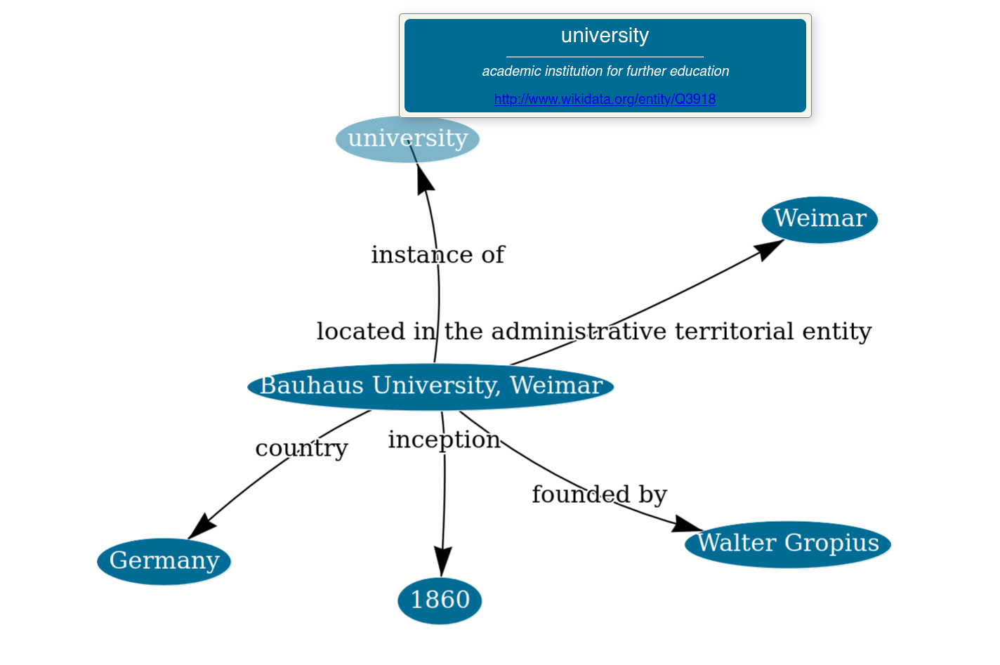

# WAKA: Webis Assisted Knowledge Graph Authoring

  


Encyclopedic knowledge graphs, such as [Wikidata](https://www.wikidata.org/wiki/Wikidata:Main_Page), host an extensive repository of millions of knowledge statements. However, domain-specific knowledge from fields such as history, physics, or medicine is significantly underrepresented in those graphs. Although few domain-specific knowledge graphs exist (e.g., Pubmed for medicine), developing specialized retrieval applications for many domains still requires constructing knowledge graphs from scratch. To facilitate knowledge graph construction, we introduce WAKA: a Web application that allows domain experts to create knowledge graphs through the medium with which they are most familiar: natural language.  



## Get started

To use WAKA, you can either use the publicly available service or deploy WAKA locally on your machine. 

### Use the public service

The public service is available at [https://waka.webis.de](https://waka.webis.de).

#### Knowledge graph construction API

In addition to the knowledge graph authoring GUI, there is an API endpoint available to automatically construct knowledge graphs from text.
 
Domain: `POST waka.webis.de/api/v1/kg`    
Request body: 
```json
{"content":  "<your text>"}
```  
Response body:
```json
{
  "text": "<your text>",
  "triples": [
    {"subject":  "<ENTITY_OBJ>", "predicate": "<PROPERTY_OBJ>", "object":  "<ENTITY_OBJ>"},
    {"subject":  "<ENTITY_OBJ>", "predicate": "<PROPERTY_OBJ>", "object":  "<ENTITY_OBJ>"},
    "..."
  ],
  "entities": [
    "<ENTITY_OBJ>",
    "<ENTITY_OBJ>",
    "..."
  ],
  "entity_mentions": [
    "<ENTITY_MENTION_OBJ>",
    "<ENTITY_MENTION_OBJ>",
    "..."
  ]
}
```
JSON object schemas:
```json
{ // <ENTITY_OBJ>
  "url": "http://www.wikidata.org/entity/...",
  "label": "label in Wikidata",
  "description": "description in Wikidata",
  "score": 1.0,
  "mentions": [
    "<ENTITY_MENTION_OBJ>",
    "..."
  ]
}
```

```json
{ // <ENTITY_MENTION_OBJ>
  "url": "http://www.wikidata.org/entity/...",
  "label": "label in Wikidata",
  "description": "description in Wikidata",
  "start_idx": 0,
  "end_idx": 20, 
  "text": "mention span content",
  "score": 1.0,
  "e_type": "NER Type"
}
```

```json
{ // <PROPERTY_OBJ>
  "url": "http://www.wikidata.org/prop/direct/...",
  "label": "label in Wikidata",
  "description": "description in Wikidata"
}
```

Example call with curl:
```shell
curl -X POST -H "Content-Type: application/json" -d "{\"content\":  \"The Bauhaus-Universität Weimar is a university located in Weimar, Germany.\"}" https://waka.webis.de/api/v1/kg

```

### Deploy service (without Docker)

The local deployment of WAKA requires a Nvidia GPU with at least 10GB of VRAM and a minimum of 20GB RAM.   

#### Installation

Clone this repository and execute the following command (requires `build-essential`):
```shell
make clean install
```

#### Run server

```shell
make run
```

After starting the server, WAKA will be available at http://localhost:8000/static/index.html

### Deploy service (with Docker)

A prebuilt docker image of WAKA is available. To spawn a container with this image execute the following command (requires `nvidia-container-toolkit` for GPU support):
```shell
docker run --gpus all -P 8000:8000 registry.webis.de/code-lib/public-images/waka:latest
```

After the container is done setting up, WAKA is available at http://localhost:8000/static/index.html

#### (Optional) Rebuild Docker image
This only becomes necessary if you make adjustments to the code. Execute the following command to build a new image of WAKA from the project directory.
```shell
docker build -t <my-name>:<version> . 
```


## Cite this work
If you make use of WAKA's authoring GUI or the knowledge graph creation algorithm, please cite the following work.
```bibtex
@InProceedings{gohsen:2024a,
  author =                   {Marcel Gohsen and Benno Stein},
  booktitle =                {9th ACM SIGIR Conference on Human Information Interaction and Retrieval (CHIIR 2024)},
  doi =                      {10.1145/3627508.3638340},
  isbn =                     {979-8-4007-0434-5/24/03},
  month =                    mar,
  publisher =                {ACM},
  site =                     {Sheffield, United Kingdon},
  title =                    {{Assisted Knowledge Graph Authoring: Human-Supervised Knowledge Graph Construction from Natural Language}},
  year =                     2024
}
```
